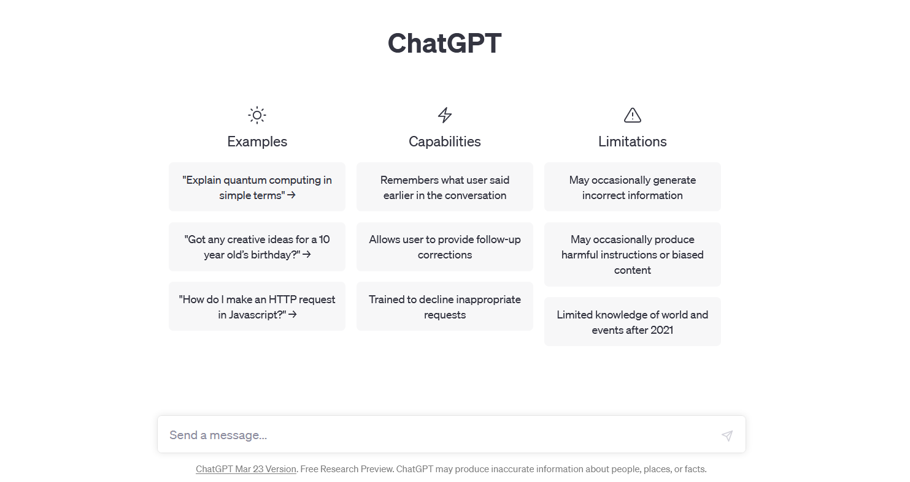
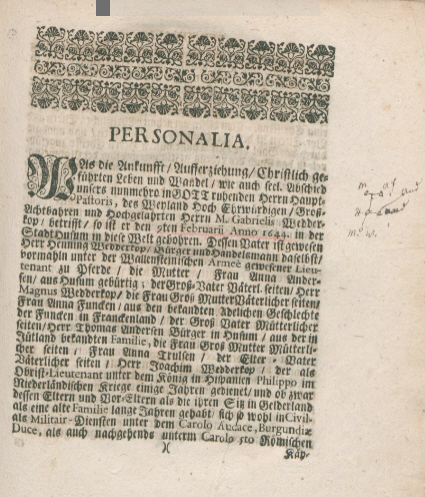

<!--

author: Swantje Piotrowski, Gregor Große-Bölting
email:  ggb@informatik.uni-kiel.de
version: 0.1
language: en
narrator: UK English Female

\-->

# Digitale Editionswissenschaft<br/>unterstützt durch KI-Schreibwerkzeuge

**Dozierende:**

* Dr. Swantje Piotrowski, M.A.
* Gregor Große-Bölting, M.A., M.A.

**Zeit und Raum:** Do 10:15 - 11:45, Raum n.V.

**Inhalt:**

In der Veranstaltung zum Thema "Digitale Editionswissenschaft unterstützt durch KI-Schreibwerkzeuge" bieten wir eine Einführung in die Anwendung digitaler Methoden in der Editionswissenschaft. Die Teilnehmer erwerben Kenntnisse in den Bereichen Transkription von historischen Dokumenten, fachwissenschaftliche Einordnung, Auszeichnung von Dokumenten und den Standards dafür sowie den Umgang mit Technologien wie TEI, XSLT und HTML. Weitere Schwerpunkte sind die produktive Verwendung von visuellen Editoren sowie ein kritischer Umgang mit KI-Schreibwerkzeugen. Am Ende werden die Teilnehmer lernen, wie sie die Ergebnisse visualisieren und mit externen Quellen verknüpfen können. Als Prüfungsleistung gilt die Erstellung eines Reflexionsberichts über den Arbeits- und Forschungsprozess sowie die Visualisierung der editorischen Leistung.

Programmierkenntnisse sind nicht erforderlich.

**Lernziele:**

* Transkription von Dokumenten der frühen Neuzeit
* fachwissenschaftliche Einordnung der Leichenpredigten
* Auszeichnung von Dokumenten und Auszeichnungsstandards
* Umgang mit X-Technologien (TEI, XSLT, HTML)
* Verwendung von visuellen Editoren
* produktiver Umgang mit ChatGPT
* kritischer Umgang mit KI-Schreibwerkzeugen
* Visualisierung der Ergebnisse
* wenn möglich: Anbindung externer, programatischer Quellen (Gelehrtenverzeichnis, Wikidata o. ä.)

**Weiterführende Literatur:**

* **Baillot, Anne/Schnöpf, Markus**: Von wissenschaftlichen Editionen als interoperablen Projekten, oder: Was können eigentlich digitale Editionen?, in: Digital Humanities. Praktiken der Digitalisierung, der Dissemination und der Selbstreflexivität, hrsg. von Wolfgang Schmale, Stuttgart 2015, S. 139-156.

**Link zu OLAT:** https://lms.uni-kiel.de/auth/RepositoryEntry/5309268542/CourseNode/107413399882620

## Sitzung am 20.04.

### Semesterplan und Prüfungsleistung

**Termine:**

| Datum | Thema/Inhalt |
|-------|--------------|
| 20.04. | Einführung in das Thema und (Digitale) Editionswissenschaft |
| 27.04. | Inhaltliche Einführung in den Themenbereich "Leichenpredigten" (Gelehrtenverzeichnis) / XML-Grundlagen |
| 04.05. | Inhaltliche Einführung cont'd / Auszeichnung von Dokumenten und TEI |
| 11.05. | Quellenkundliche Einführung und Transkription |
| 18.05. | CHRISTI HIMMELFAHRT |
| 25.05. | TEI, XSLT und HTML und gemeinsame Arbeit: Erstellung eines TEI-Dokuments |
| 01.06. | (visuellen Editoren) und KI-Schreibwerkzeuge |
| 08.06. | Visualisierung der Ergebnisse |
| 15.06. | gemeinsame Arbeit |
| 22.06. | gemeinsame Arbeit |
| 29.06. | Anbindung externer Quellen |
| 06.07. | Präsentation der Ergebnisse, Evaluation |

**Prüfungsleistung:**

* Reflexionsbericht über Arbeits- und Forschungsprozess
* Produkt, sprich Visualisierung der editiorischen Leistung

### "Regierungserklärung"

1. Diese Veranstaltung ist ein Experiment: Wir setzen neue Methoden und Software ein. Seid also nachsichtig mit uns und mit euch selbst, wenn mal etwas nicht funktioniert wie geplant. Lasst uns zeitnah wissen, wenn ihr Probleme habt, dann findet sich für alles eine Lösung!
2. Es dürfen alle KI-Tools verwendet werden, die ihr möchtet, aber es muss transparent gemacht werden, wie und in welchem Umfang. Am Ende muss eure Prüfungsleistung nach wie vor als eigene Leistung erkennbar sein.
3. Der Seminarplan ist "im Fluss".

### ChatGPT verwenden



Die Nachricht, die man ChatGPT (und ähnlichen Systemen) schickt, wird auch *prompt* genannt. Die Qualität der Ausgabe hängt erheblich davon ab, wie *gut* der eingegebene *prompt* ist. Der Vorgang der Entwicklung möglichst passgenauer *prompts*, wird auch als *prompt design* bezeichnet. *Prompt design* ist mehr Kunst als Wissenschaft und erfordert häufig gezieltes Herumprobieren. Es gibt jedoch einige generelle *best practices*.

Übrigens: *Prompts* können sowohl auf Englisch als auch auf Deutsch eingegeben werden. Von der Eingabesprache hängt häufig auch die Ausgabesprache ab, sofern man nicht definitiv eine Ausgabe in einer bestimmten Sprache anfordert.

#### Rollenspiel

Man kann ChatGPT bitten Rollen einzunehmen und eine Frage oder einen Sachverhalt vor dem Hintergrund dieser Rolle zu kommentieren. Bei Personen, für die ausreichend viele schriftliche Zeugnisse zur Verfügung stehen, kann man sich auch erkundingen, wie eine Stellungnahme der historischen Person aussehen würde.

Angenommen wir möchten verschiedene Einschätzungen eines interessanten Phänomens, dass wir alle in den vergangenen Jahren erfahren haben...

Was würde ein Psychologe sagen?


Was würde ein Physiker sagen?


Was würde ein Philosoph sagen?


Was würde Shakespeare sagen?


#### Fragen stellen lassen

Ein weiteres Verfahren, um gute Ausgaben zu generieren, besteht darin, ChatGPT die "richtigen" Fragen stellen zu lassen. Dazu beschreibt man ein Anliegen oder Problem und bittet ChatGPT darum Fragen zu stellen, die das Problem vertiefen:

> Ich muss eine kurze, geschichtswissenschaftliche Einschätzung darüber schreiben, welchen Effekt dieses Phänomen der veränderten Zeitwahrnehmung während Corona auf die Geschichtsschreibung haben wird. Ich möchte diese Einschätzung gerne mit dir zusammen schreiben. Stell mir dazu zunächst die richtigen Fragen!

ChatGPT antwortet mit einer Reihe von Fragen:


Die Beantwortung der Fragen erfolgt nach dem folgenden Schema:

1. Antwort auf Frage 1
2. Antwort auf Frage 2
3. usw.

Da die Antwort "in einem" erfolgen sollte ist es wichtig Umbrüche zu machen: Das funktioniert mit `Shift + Enter`.

Die Ergebnisse sind häufig nicht sehr gut:

> Die Coronapandemie hat zu einer veränderten Wahrnehmung von Zeit geführt, die sich auf verschiedene Aspekte des menschlichen Lebens ausgewirkt hat. Historisch gesehen haben Krisen und Ereignisse in der Vergangenheit oft zu ähnlichen Veränderungen in der Wahrnehmung von Zeit geführt. Die Auswirkungen der Pandemie auf die Geschichtsschreibung sind vielfältig: Einerseits haben die neuen Technologien und die zunehmende Digitalisierung die Entstehung von umfangreichem Datenmaterial begünstigt, welches zukünftige Historiker für ihre Analysen nutzen können. Andererseits hat die Krise auch globale Auswirkungen, wie den Zusammenbruch von Lieferketten und die angespannte Handelssituation, die sich auch auf die Weltpolitik auswirken. Es bleibt abzuwarten, wie zukünftige Historiker die Auswirkungen der Pandemie auf die Wahrnehmung von Zeit und den menschlichen Umgang damit interpretieren werden.

Dadurch, dass man sich aber durch die Beantwortung der Fragen mit der Materie vertieft auseinandergesetzt und auch bereits selbst Textschnipsel produziert hat, fällt einen das Schreiben eines eigenen Textes sehr viel leichter.

#### Daten strukturieren

ChatGPT ist gut darin aus unstrukturierten Daten, strukturierte Daten zu machen. Ein Beispiel:

> Ich habe den folgenden Literatureintrag im APA-Zitierstil:
>
> Sahle, P. 2016. 2. What is a Scholarly Digital Edition? In: Driscoll, M. J., & Pierazzo, E. (Eds.), Digital Scholarly Editing: Theories and Practices. Open Book Publishers. aus dem Werk: http://books.openedition.org/obp/3397
>
> Formatier in bitte als bibtex!

`bibtex` ist ein Literaturformat, dass zur strukturierten Speicherung bibliographischer Daten und in LaTeX für die Generierung und Ausgabe von Literaturangaben und -verzeichnissen verwendet wird.

Antwort von ChatGPT:

> Sure, here's the bibtex entry for the citation you provided in APA style:
>
> ```
> @incollection{sahle2016,
>  author       = {Sahle, Patrick},
>  title        = {What is a Scholarly Digital Edition?},
>  booktitle    = {Digital Scholarly Editing: Theories and Practices},
>  editor       = {Driscoll, Matthew James and Pierazzo, Elena},
>  year         = {2016},
>  publisher    = {Open Book Publishers},
>  url          = {http://books.openedition.org/obp/3397},
>  address      = {Cambridge},
>  pages        = {17-34}
> }
> ```

Welche Angaben in der Ausgabe von ChatGPT könnten problematisch sein (und warum?) und bedürfen voraussichtlich einer händischen Anpassung? Warum ist die Ausgabe dennoch nützlich?

#### Alternativen

Es gibt auch andere Systeme als ChatGPT und Anbieter für ähnliche Systeme als OpenAI.

Ein Beispiel ist das israelische System ai21, das zwar nicht ganz so, aber auch sehr gute Ergebnisse liefert:


#### Aufgabe

Bildet Kleingruppen aus 3 bis 4 Teilnehmer:innen.

Verwendet eine Textgenerierungssoftware wie ChatGPT (oder GPT3, GPT4, AI21), um einen zwei Minuten-Vortrag über folgendes Thema vorzubereiten:

> Sinn und Unsinn einer digitalen Edition Kieler Leichenpredigten

Speichert die Prompts, die Ihr verwendet habt und diskutiert die folgenden Fragen:

1. Wie sind Prompts formuliert, die für euch gut funktioniert haben?
2. Funktioniert die Textgenerierung problemlos? Wo musstet ihr (in welchem Umfang nacharbeiten)?
3. Kann Textgenerierungs-KI *einfach so* verwendet werden? Wo seht ihr Probleme?
4. Welche Fertigkeiten und Kompetenzen sind erforderlich, um Textgenerierungs-KI zu verwenden.

**Bonus:** Illustriert den Vortrag mit KI-generierten Bildern eines Diensts wie Dall:e2 oder Midjourney.

Ihr habt für die Aufgabe 15 Minuten Zeit.

## Sitzung am 27.04.

### Wiederholung: KI (Schreib-)Werkzeuge

> Wo könnten in diesem Seminar KI Werkzeuge einen sinnvollen und wichtigen Beitrag leisten? Warum?

### Editionswissenschaft

**Was ist eine Edition?**

> Eine Edition ist die erschließende Wiedergabe historischer Dokumente.

1. „erschließend“: Eine Edition reichert die Wiedergabe durch kritisches Wissen an.
2. „Wiedergabe“: Die Edition zielt auf die Repräsentation bereits existierender Texte.
3. "historisch“: Die Edition beschäftigt sich mit Texten bzw. Dokumenten, zu denen eine historische Distanz besteht. Ihre Überwindung ist das Ziel der Edition.
4. „Dokumente“: Das „Dokument“ ist ein verallgemeinernder Begriff für Texte in einem abstrakten Sinne.

Institut für Dokumentologie und Editorik:
https://www.i-d-e.de/themen/editorik/

**Was ist eine Edition?**

Sichtung der Überlieferung +

* Textkritik
* Konstituierter Text
* Publikation

  = Edition

  **Wozu das Ganze?**
* Grundlagenarbeit für die weitere Forschung;
* Kritische Auseinandersetzung mit der Überlieferung;
* Erarbeitung von wissenschaftlichen Informationsressourcen;
* Stabilisierung, Kanonisierung, Referenzierbarkeit

### Digitale Editionen

> A digitised edition is not a digital edition. (Sahle 2016)

Digitale Editionen sind multimedial: Ein Text, der online steht, ist noch keine digitale Edition. Es geht nicht um das Speichermedium.

> A digital edition cannot be given in print without significant loss of content and functionality. (Sahle 2016)

Digitale Editionen haben eine erweiterte Funktionalität gegenüber einer gedruckten Editionen: Eine digitale Edition drucken bedeutet in der Regel Verlust von Funktion(en). Die zusätzlichen Funktionen resultiert aus der Durchsuch- und Filterbarkeit digitaler Medien, mehr noch aber durch die Verwendung von Hypertext und die Verknüpfung verschiedener Ressourcen.

> A scholarly edition is the critical representation of historic documents. (Sahle 2016)

Digitale Editionen sind nicht nur Text/Bild + Metadaten, wie bei einem digitalen Archiv: Digitale Editionen erfordern kritische Auseinandersetzung, wie auch andere Editionen. Die kritische Auseinandersetzung wird durch die umfangreiche Kontextualisierung digitaler Angebot befördert.

> Scholarly digital editions are scholarly editions that are guided by a digital paradigm in their theory, method and practice. (Sahle 2016)

Dig. Editionen sollten gewissen Qualitätsstandards entsprechen, bspw. in der Art und Weise der Präsentation der Daten, wie auch der verwendeten Methodiken (Beachtung von (Meta-)Datenstandards, Transkriptionsregeln, FDM); idealerweise sind die publizierten Daten FAIR (Findable, Accessible, Interoperable, Reusable).

Außerdem wir häufig angestrebt das *Single Source Principle* zu erfüllen, in dem bspw. TEI XML oder ein ähnliches Standarddatenformat verwendet wird.

Um zu beantworten, ob etwas eine digitale Edition ist, können entsprechend die folgenden Fragen herangezogen werden:

> 1. Is there a full representation of the subject in question? This may be an edited text or at least a very accurate transcription. Sometimes, although this is rather an exception than the rule and depends on the specific characteristics of the material, a digital facsimile may suffice. Sometimes even a structured database can be a complete representation.
> 2. Is it *critical*? Have rules for the processing of the material been stated and substantiated? Have these rules been applied in the light of the relevant scholarly knowledge on the material, its genesis, its contexts and its reception? Does the edition add information to the representation making it more accessible, understandable and usable?
> 3. Is the edition of academic quality? Have the rules been applied rigorously and in a transparent manner? Are the responsibilities stated clearly? Does the edition suffice as a substitute for the previous editions or primary documents making it unnecessary to go back to them in most cases? Does it enable further scholarly research on a reliable and trustworthy basis?
> 4. Does the edition follow a digital paradigm? Does it make use of the possibilities of digital technology and media? Is it not printable without a major loss of content and functionality? (Sahle 2016)

---

Sahle, P. 2016. 2. What is a Scholarly Digital Edition? In: Driscoll, M. J., & Pierazzo, E. (Eds.), Digital Scholarly Editing: Theories and Practices. Open Book Publishers. aus dem Werk: http://books.openedition.org/obp/3397

#### Beispiel: RuneS Datenbank

Was macht diese Edition zu einer *digitalen* Edition?


#### Beispiel: When The Wall Came Down

Was macht diese Edition zu einer *digitalen* Edition?


### Leichenpredigten

Quellenerschließung Leichenpredigt


> Welche Elemente fallen Ihnen an diesem Titelblatt auf?

> Welche Informationen halten Sie für wichtig?

https://dibiki.ub.uni-kiel.de/viewer/image/PPN875662757/1/

#### Aufbau des Quellentypus Leichenpredigt

Die Leichenpredigten gehören zur Gattung der Personalschriften, also den Schriften, die zu Geburtstagen, Taufen, Verlobungen, Hochzeiten, Amtseinführungen, Jubiläen und zum Tod eines Menschen verfasst und häufig auch gedruckt wurden.

Die Leichenpredigt besteht aus folgenden festen Gliederungspunkten:

1. Widmung
2. Vorrede
3. Leichenpredigt
4. Exordium
5. Abhandlung
6. Personalia/Lebenslauf

Weitere Informationen zur Quellengattung Leichenpredigt finden sich unter:
http://www.personalschriften.de/leichenpredigten.html

##### Widmung

Nennung der Personen, denen der Verfasser die Leichenpredigt widmet.


##### Leichenpredigt

„Im Nahmen Jesu Amen!“ Hier findet man die Predigt, die der Pfarrer am Grab oder in der Kirche auf den Verstorbenen gehalten hatte.


##### Exordium (Eingang)

Es führt im allgemeinen in den theologischen Teil der Predigt ein.


##### Abhandlung (Hauptteil der Predigt)

Hier wird der Leichtext (eine Textstelle der Bibel) ausgelegt und erläutert, eine Lehre aus ihm gezogen und häufig in der zur Gemeinde und/oder zur verstorbenen Person in Beziehung gesetzt.


##### Personalia

In ihm wird der Lebensweg des Verstorbenen mehr oder weniger detailliert geschildert. Sein Ziel ist es, den Verstorbenen als einen beispielhaften Christen zu präsentieren.



#### Quellenwert?

> Für welche verschiedenen wissenschaftlichen Disziplinen könnte die Gattung Leichenpredigt von Interesse sein?

#### Disziplinen

* Sozial- und Wirtschaftsgeschichte
* Theologie
* Genealogie und Biographik
* Literaturgeschichte
* Kunstgeschichte
* Medizingeschichte
* Pharmaziegeschichte
* Historische Demographie
* Universitätsgeschichte
* Bildungsgeschichte
* historische Familiengeschichte

### Gelehrtenverzeichnis

Informationen und Anschlussmöglichkeiten


https://cau.gelehrtenverzeichnis.de/

## Sitzung am 04.05.

### XML-Grundlagen

> Wo sind euch bereits XML-Formate begegnet?
>
> Welche Beispiele könnt ihr nennen?
>
> Warum könnte das eine sinnvolle Möglichkeit sein Daten abzulegen?

#### Beispiele

Sowohl Word, als auch Excel (und andere Microsoft Office-Tools) speichern ihre Daten im XML-Format ab. Dafür steht das *x* in der Dateiendung *.docx* bzw. *.xlsx* (in dem Fall: das zweite *x*). Man *sieht* die XML-Daten nicht, weil sie komprimiert werden, im sogenannten Zip-Format. Mit ein wenig technischem Verständnis kann man aber die Rohdaten sichtbar machen. In der Regel ist das nicht erforderlich und sollte auch nicht gemacht werden: Word und Excel "wissen", wie sie mit diesen Informationen umgehen müssen, händische (menschliche) Interventionen können die Daten zerstören.

Ein weiteres Beispiel für XML (genau genommen: ein XML-ähnliches Format) ist die Hypertext Markup Language (HTML), die zum Bau von Websiten verwendet wird:


#### Grundlagen

XML — kurz für: eXtensible Markup Language — ist ein textbasiertes Format zur Speicherung von Daten. Von XML leiten sich verschiedene andere Standards ab, die jedoch alle gleichen Prinzipien folgen. Beispiele für solche abgeleiteten Standards sind TEI (*Text Encoding Initiative*), RDF (*Resource Description Framework*) oder XSLT (*Extensible Stylesheet Language Transformation*). XML ist eine Art Metasprache, um verschiedene Wege zu ermöglichen standardisierte Datenbeschreibungen vorzunehmen.

XML-Dokumente bestehen aus sogenannten *tags*:

```xml
<name>Max Mustermann</name>
```

Der *tag* ist in diesem Fall *name*, der aus einem öffnenden und schließenden (mit einem "/" beginnend) Anteil gebildet wird. Dadurch wird ausgezeichnet, *was* beschrieben wird, in diesem Fall ein Name. Der konkrete Name steht zwischen den Tags. Einzelne XML-Tags funktionieren also wie ein Oreo-Keks: Außen herum ist die langweilige, harte Beschreibung, innendrin der weiche, semantische Kern.


*Tags* können nun ineinander geschachtelt werden oder auch nebeneinander stehen. Stehen zwei *tags* nebeneinander spricht man von Geschwistern, ist ein Tag in einem anderen geschachtelt, so spricht man bei dem inneren von dem Kind- (oder *child*), bei dem äußeren von dem Vater- bzw. Eltern- (oder *parent* bzw. *ancestor*) *tag*.

Es **muss** immer ein Wurzelelement (*root element*) geben, dass alle anderen Elemente beinhaltet. Innerhalb dieses Wurzelelements kann es *siblings* geben, aber das *root element* kann niemals *sibling* zu einem anderen sein.

., CC BY-SA 3.0 <http://creativecommons.org/licenses/by-sa/3.0/>, via Wikimedia Commons")

In diesem Sinne funktioniert XML wie eine Matroshka-Puppe, da sich *tags* ineinander schachteln und dadurch hierarchische Strukturen bilden lassen:

```xml
<person>
  <name>Max Mustermann</name>
  <alter>30</alter>
  <adresse>
    <straße>Hauptstraße 1</straße>
    <stadt>Berlin</stadt>
    <land>Deutschland</land>
  </adresse>
</person>
```

Ist ein XML-Dokument in diesem Sinne korrekt formatiert, dann sagt man auch es sei **well-formed**: Es wurden keine syntaktischen Fehler gemacht, alle Klammern schließen korrekt und die öffnenden und schließenden *tags* sind korrekt gesetzt.

Es ist zudem möglich ein spezielles Schema mit einem Dokument zu verknüpfen um kenntlich zu machen, welche *tags* es gibt und in welcher Beziehung diese zueinander stehen können. Geschieht dies, so lässt sich automatisch überpüfen, ob ein Dokument **valide** (*valid*) ist.

Noch ein Hinweis zum Schluss: Wenn ein XML-Dokument selbst bestimmte Sonderzeichen innerhalb eines Tags verwenden möchte, so müssen diese Zeichen **escaped** werden:

```xml
<formula>3 < 4 => True</formula>
```

Würde unweigerlich zu einem Fehler führen, während

```xml
<formula>3 &lt; 4 =&gt; True</formula>
```

korrekt ist.

---

Als Vorlage dieses Abschnitts diente der hervorragende Blogbeitrag [A shamelessly short intro to XML for DH beginners (includes TEI)](https://latex-ninja.com/2022/02/02/a-shamelessly-short-intro-to-xml-for-dh-beginners-includes-tei/)

#### ChatGPT: Erklär mir XML als wäre ich ein 5-jähriger

Stell dir vor, dass du ein Bild malst und es deiner Freundin oder deinem Freund zeigen möchtest. Wenn du einfach nur das Bild zeigst, kann es schwierig sein, bestimmte Details oder Informationen zu erklären. Wenn du jedoch das Bild in kleinere Abschnitte aufteilst und jeder Abschnitt einen Namen gibst, kann es viel einfacher sein, bestimmte Elemente des Bildes zu identifizieren und darüber zu sprechen.

XML funktioniert auf eine ähnliche Weise. Es teilt Informationen in klar definierte Abschnitte auf, die als "Tags" bezeichnet werden, und jedem Tag wird ein Name gegeben, der beschreibt, was in diesem Abschnitt enthalten ist. Diese Tags können dann in einer bestimmten Reihenfolge angeordnet werden, um eine Struktur oder einen "Baum" von Informationen zu erstellen.

Zum Beispiel könnte XML verwendet werden, um Informationen über eine Person zu organisieren und auszutauschen:

```xml
<person>
  <name>Max Mustermann</name>
  <alter>30</alter>
  <adresse>
    <straße>Hauptstraße 1</straße>
    <stadt>Berlin</stadt>
    <land>Deutschland</land>
  </adresse>
</person>
```

In diesem Beispiel gibt es einen "person"-Tag, der die gesamten Informationen über eine Person enthält. Der "name"-Tag enthält den Namen der Person, der "alter"-Tag enthält das Alter, und der "adresse"-Tag enthält Informationen über die Adresse der Person, einschließlich der Straße, Stadt und Land. Jeder Tag ist klar definiert und in einer bestimmten Reihenfolge angeordnet, um die Informationen übersichtlich darzustellen.

Durch die Verwendung von XML können Computer leichter Informationen austauschen, weil sie wissen, wo sie bestimmte Informationen finden und wie sie auf diese zugreifen können, ohne dass menschliche Intervention erforderlich ist.

#### Übungen

**1.** Gegeben ist das folgende XML-Dokument:

```xml
<person>
  <name>Max Mustermann</name>
  <alter>30</alter>
  <adresse>
    <straße>Hauptstraße 1</straße>
    <stadt>Berlin</stadt>
    <land>Deutschland</land>
  </adresse>
</person>
```

a) Ist das Dokument **well-formed**?

[(X)] Ja
[( )] Nein

b) In welchem Verhältnis stehen die *tags* *name* und *alter* (X ist \_ zu Y) zueinander?

[( )] root element
[( )] child
[( )] parent
[(X)] sibling
[( )] ancestor
[( )] successor

c) In welchem Verhältnis stehen die *tags* *person* und *adresse* (X ist \_ zu Y) zueinander?

[( )] root element
[( )] child
[(X)] parent
[( )] sibling
[( )] ancestor
[( )] successor

d) In welchem Verhältnis stehen die *tags* *land* und *person* (X ist \_ zu Y) zueinander?

[( )] root element
[( )] child
[( )] parent
[( )] sibling
[( )] ancestor
[(X)] successor

---

**2.** Das folgende XML-Dokument ist nicht **well-formed**:

```xml
<book>
  <title>Harry Potter and the Sorcerer's Stone</title>
  <author>J.K. Rowling</autor>
  <year>1997</year>
  <publisher>Scholastic</publisher>
</book>
  <genre>Fantasy</genre>
```

Welche Fehler sind darin enthalten?

[[X]] Es gibt kein Wurzelelement
[[ ]] Der Title-tag wird nicht korrekt geschlossen
[[X]] Der Author-tag wird nicht korrekt geschlossen
[[ ]] Es gibt keinen Publisher namens "Scholastic"
[[ ]] Harry Potter gehört in die Kategorie "YA Fantasy"

---

**3.** Das folgende XML-Dokument ist nicht **well-formed**:

```xml
<book>
  <title>The Catcher in the Rye<title>
  <author>J.D. Salinger<author>
  <year>1951</year>
  <publisher>Little, Brown and Company</publisher
</book>
```

Welche Fehler sind darin enthalten?

(Auswahlmöglichkeiten wurden hier bewusst ausgespart.)

### Quellenkundliche Einführung / Metadaten

> Erfassungsrichtlinie für eine Kieler Leichenpredigt von 1696

Die Seite mit dem Dokument der UB Kiel, abrufbar auf

https://dibiki.ub.uni-kiel.de/viewer/image/PPN875662757/1/

#### Angaben zu Titel und Verfasser des vorliegenden Dokumentes

> Titel der Arbeit (Benennung dieses Dokumentes)

* Transkription der Leichenpredigt des Gabriel Wedderkops von 1696

> Untertitel (Benennung des bearbeiteten Abschnitts des Werkes: Seitenzahl der Originalquelle)

* Seite 1:1 – 40:- (32 gezählte Seiten + 8 ungezählte)

> Transkribiert von Originalmanuskript (Namen der Bearbeiter)

* Swantje Piotrowski

#### Kursleitung

> Titel des Kursleiters (z.B. Dr.)

* Dr. phil.

> Vorname des Kursleiters

* Swantje

> Nachname des Kursleiters

* Piotrowski

> Übergeordnete verantwortliche Einrichtung (Institut und Universität)

* Historisches Seminar CAU Kiel

#### Angaben zur Veröffentlichung des Dokumentes

> Kursname (Titel der Lehrveranstaltung)

* Projektseminar zur Geschichte der Neuzeit: Digitale Editionen

> Semester (WS \_\_/ SoSe \_\_ )

* SoSe2023

> Datum (tt.mm.jjjj) (aktuelles Datum)

* 4.April 2023

#### Quellenbeschreibung

> Aufbewahrungsort des Originaldokuments Land (Staat)

* Deutschland

> Region (z.B. Bundesland)

* Schleswig-Holstein

> Stadt (Stadtname)

* Kiel

> Einrichtung, die das Dokument aufbewahrt (Bibliothek, Museum o.a.)

* Universitätsbibliothek der CAU zu Kiel

> Signatur der Handschrift (Kombination aus Buchstaben und Zahlen)

* Arch2 70 82

#### Beschreibung des Dokuments

> Angabe der Seitenzahlen

* Seite 1:1 – 40:- (32 gezählte Seiten + 8 ungezählte)

> Autor (Name des Verfassers des Originaltexts)

* Franck, Wolfgang Christoph

> Titel des Dokuments

* Die an Gott stets bleibende Gottes-Kinder/ Aus denen erwehlten Worten des LXXIII. Psalms/ v. 23. 24

> Untertitel des Dokuments

* Bey ansehnlicher und Volckreicher Beerdigung Des Hn. M. Gabriel Wedderkops/ Wohlverdienten Pastoris Primarii der Gemeidne St. Nicolai in Kiel

> Verlag / Drucker

* Acad. Buchdr. / Gedruckt durch Joachim Reumann

> Auflage

* 1 Auflage

> Genre

* Gebrauchsliteratur; Leichenpredigt

#### Physikalische Beschreibung des Manuskripts

> Beschreibstoff (auf welchem Material wurde geschrieben)

* Nicht herauszufinden

> Anzahl der Seiten (in Bl. =Blatt; Beispiel: 156 Bl.)

* 40 Bl.

> Höhe eines Blattes (in cm)

* Nicht herauszufinden

> Breite eines Blattes (in cm)

* Nicht herauszufinden

> Anzahl der Spalten

* 1

> Name der Schriftart (Name der im Manusskript verwendeten Schriftart; Beispiel: Insulare Rundschrift)

* Fraktur

> Beschreibung des Einbands

* Nicht herauszufinden

#### Angaben zur Entstehungsgeschichte des Dokuments

> Entstehungsort (Stadt, Region, Gebiet, Staat etc.)

* Kiel, Schleswig-Holstein, Deutschland

> Datum / Zeitraum der Entstehung

* 1696

#### Transkriptionsübung

* Aufgabe 1: Übertragung der Handschrift ins moderne Schriftbild (unter Beibehaltung der originalen Zeilenumbrüche, Ausformulierung der Abkürzungszeichen)
* Aufgabe 2: Auflistung von Personen und Orten


### Hausaufgabe

Lesen Sie Kapitel 9 "XML" (S. 128 - 146) in:

Jannidis, F.; Kohle, H. & Rehbein, M. (Eds.): *Digital Humanities*. J.B. Metzler, 2017.

## Sitzung am 11.05.

### Wiederholung: XML

Wiederholungsfragen zur letzten Woche bzw. zum Kapitel 9 aus Jannidis:

1. Warum müssen bestimmte Zeichen mit speziellen Zeichen enkodiert werden, bspw. '<' durch '&lt;'?
2. Was ist der Unterschied zwischen *well formed* und *valid* in Bezug auf XML?
3. Was bedeutet es, dass XML eine Metasprache ist?
4. Welche Funktion haben Schemata?
5. Was ist ein Namensraum (*namespace*)?
6. Was ist XSLT und wofür wird es benötigt bzw. eingesetzt?

---

Das folgende XML-Dokument enthält einige Probleme, welche?

```xml
<book>
  <title>The Great Gatsby</title>
  <author>F. Scott Fitzgerald</author>
  <year>1925<year>
  <publishing>
    Publishing House
    <name>Penguin</name>
    <city>New York</city>
  </publishing>
</book>
```

---

Gegeben ist das folgende XML-Snippet:

```xml
<library>
  <book>
    <title>The Hobbit</title>
    <author>J.R.R. Tolkien</author>
    <year>1937</year>
    <publisher>Houghton Mifflin</publisher>
  </book>
  <book>
    <title>To Kill a Mockingbird</title>
    <author>Harper Lee</author>
    <year>1960</year>
    <publisher>J. B. Lippincott &amp; Co.</publisher>
  </book>
</library>
```

In welchen Verhältnissen stehen die Elemente zueinander?

### Fortsetzung "Transkription"

Da er dan von vorbesagter Schule nach der Fürstl. Universität Helmstett gereiset / und ein Jahr unter information des Herrn Doct. Zappen /SS. Theolog. Professor. Ordinar. als auch bey dessen Tisch daselbst verharret / und wie ihm gefällig ferner in Teutschland zureisen und die daselbst herum liegende Universitäten zubesehen / hat er sich von dannen durch Hessen / auf die Universität Marpurg und Giesen eine Monahten verweilend / nacher Heidelberg zu seinen Bruder Herrn Magno von Wedderkop Juris utriusque Doctori, und dahmaligen Juris publici & feudalis Professori Ordinario, nunmehro Ihro zu Schleßwig Hollstein regierenden Hoch Fürstl. Durchl. hochbetrauten Geheimbten Estats-Raht und Ambtmann zu Tremsbüttel begeben / nach verfliessung einiger Jahren aber weiter nach der Universität Tübing verfügt / um mit denen berühmten Leuten als Herr Doct. Osiandro und Wulfino in eine gute Kundschafft zugerahten.
Wie es ihm daselbst nun nicht gefallen wollen / hat er sich nach verfliessung ungefehr vier Monathen nach der berühmten Universität Straßburg erhoben / woselbst er bey nahe 2. Jahr sich aufgehalten und mit großen Nutzen der berühmten Theologorum als Herr Doct. Danhaureri, Doct. Schmidii, Faustii, vornehmlich des Herrn Doct. Bebelii information in Theologicis bedienet / unter welchen er nicht allein unterschiedene Collegia mit guten Vergnügen gehalten / besondern auch unter den letzeren 3. disputationes als 1. De Scepticismo Arminianorum. 2. De Atheismo Socinianoorum. 3. Historico Ecclesiasticam de scriptoribus & Ministerio Ecclesiastico Ecclesiae seculi primi post Christum natum daselbst publice mit Ruhm abgelegt. Ob er nun wohl festiglich entschlossen unter anführung solcher berühmten und gelahrten Männer seine Studia ferner fortzusetzen / so ist ihm doch eine solche Gelegenheit in der Frembde ferner zu reisen an die Hand gekommen / daß er resolviret den Ohrt zu verlassen / und ist im Febr. des 1665sten Jahres darauff nacher Basel gezogen /

### Liste an Personen und Orten

Personen:

* Name: Gabriel von Wedderkop
* https://d-nb.info/gnd/121258564
* Beruf: Magister, Diakon, Hauptpastor an der        Nikolaikirche in Kiel
* Name: Magnus von Wedderkop
* https://d-nb.info/gnd/100879586
* Beruf: Rechtsgelehrter, schleswig-holsteinischer Staatsmann und Politiker
* Name: Johann Adam Osiander
* https://d-nb.info/gnd/104279427
* Beruf: Professor für ev. Theologie, Universität        Tübingen
* Name: Doct. Osiandro + Wulfino (?)

Orte

* Helmstedt: https://d-nb.info/gnd/4024344-8
* Marburg: https://d-nb.info/gnd/4037446-4
* Gießen: https://d-nb.info/gnd/4020989-1
* Heidelberg: https://d-nb.info/gnd/4023996-2
* Tremsbüttel: https://d-nb.info/gnd/4120074-3

Institutionen

* Universität Helmstett: https://d-nb.info/gnd/2051813-4
* Universität Marpurg: https://d-nb.info/gnd/2001630-X
* Universität Giesen: https://d-nb.info/gnd/36154-9
* Universität Heidelberg: https://d-nb.info/gnd/2024349-2
* Universität Straßburg: https://d-nb.info/gnd/1010669-8

### Automatische Transkription mit Transkribus

Transkribus ist ein Transkriptions-Tool, das von der Read COOP entwickelt wurde und Forschern und Wissenschaftlern dabei hilft, handschriftliche Dokumente zu digitalisieren und zu analysieren. Das Tool basiert auf der optischen Zeichenerkennung (OCR) und maschinellem Lernen und kann sowohl gedruckte als auch handgeschriebene Texte automatisch transkribieren. Darüber hinaus ermöglicht Transkribus auch die manuelle Transkription durch menschliche Transkribenten, wobei das Tool sie bei der Organisation und Verwaltung der Transkription unterstützt.

Das Tool ist besonders nützlich für historische Dokumente, Archive, Bibliotheken und Museen, die ihre Dokumente digitalisieren und archivieren möchten. Transkribus bietet auch verschiedene Analysewerkzeuge an, die es Forschern erleichtern, die Inhalte und Strukturen der transkribierten Texte zu untersuchen.

#### Die Benutzeroberfläche

##### Workdesk


##### Collections - View


##### Collections - Organizer


##### Document - View


##### Editor - Elements


##### Editor - Layout and Text 1


##### Editor - Layout and Text 2


##### Tools Organizer


#### Der Workflow

1. Account anlegen
2. Collection mit einem sinnvollen Namen erstellen
3. PDF Dokument hochladen: Entweder in der Collection oder unter Upload die Datei auswählen; aufpassen, dass der korrekte Dateityp gewählt wird.
4. Automatische Texterkennung starten:

   * *Transkribus Print M1* als Modell auswählen
   * Warten: Die Transkription kann einige Zeit in Anspruch nehmen. Einen Überblick über den Fortschritt kann man sich unter "Jobs" verschaffen.

5. Für jede Seite...

   * Layout überprüfen und anpassen: Stimmen die Regionen oder sollten Regionen zusammengelegt werden? Wurden alle Zeilen erfasst? Wurden die Marginalien erfasst?
   * Transkription überprüfen: Erkennungsfehler beheben.
   * Speichern.
   
6. Export der Ergebnisse

### Hausaufgabe

> Erstellen Sie mit Transkribus ein Transkript der Ihnen zugewiesenen (Abschnitt einer) Leichenpredigt.
>
> Geben Sie bis zum nächsten Mittwoch (17.05.) einen kurzen Arbeitsstandsbericht ab und beantworten Sie dazu die folgenden Fragen:
>
> * Wo haben Sie Probleme bzw. was bereitet Ihnen Schwierigkeiten?
> * Wo brauchen Sie Unterstützung und weitere Informationen?
> * Was klappt gut?

## Sitzung am 18.05.

**Entfällt wg. Christi Himmelfahrt.**